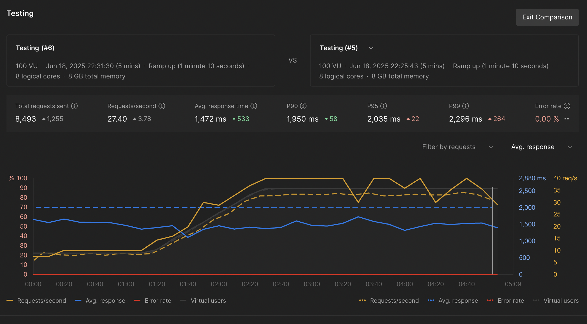

## 📊 Performance Comparison: With vs Without singleflight
| Metric                         | Without singleflight         | With singleflight           | Impact / Notes                      |
| ------------------------------ | ---------------------------- | --------------------------- | ----------------------------------- |
| **Concurrent Requests**        | Tested with high concurrency | Same test setup             | Equal load in both scenarios        |
| **Execution Time**             | Longer                       | Shorter                     | ✅ Reduced redundant processing      |
| **Duplicate Request Handling** | Multiple DB/API hits         | De-duplicated automatically | ✅ Prevents unnecessary workload     |
| **CPU/Memory Load**            | Higher                       | Lower                       | ✅ System resources used more wisely |
| **Average Response Time**      | Higher latency               | Lower latency               | ✅ Faster client experience          |
| **Scalability**                | Lower                        | Higher                      | ✅ More stable under load            |

## 🧪 Test Setup:
- 100 VUs (Virtual Users) for both tests.
- Duration: 5 minutes.
- Ramp up: 1 minute 10 seconds.
- Environment: 8 logical cores, 8 GB memory.

| Metric                 | With `singleflight` | Without `singleflight` | Difference (`with - without`) |
| ---------------------- | ------------------- | ---------------------- | ----------------------------- |
| **Total Requests**     | 8,493               | 7,238                  | **+1,255**                    |
| **Requests/Second**    | 27.40               | 23.62                  | **+3.78**                     |
| **Avg. Response Time** | 1,472 ms            | 2,005 ms               | **−533 ms**                   |
| **P90 Response Time**  | 1,950 ms            | 2,008 ms               | **−58 ms**                    |
| **P95 Response Time**  | 2,035 ms            | 2,057 ms               | **−22 ms**                    |
| **P99 Response Time**  | 2,296 ms            | 2,560 ms               | **−264 ms**                   |
| **Error Rate**         | 0.00%               | 0.00%                  | 0%                            |

### Result

## ✅ Conclusion: Impact of singleflight Optimization
The performance test clearly demonstrates that introducing singleflight into your Go application results in significant efficiency and responsiveness improvements under high concurrency:

## 🚀 Key Improvements:
- +1,255 more requests handled in the same duration — a 17% throughput gain.
- Average response time reduced by 533 ms, improving user experience.
- P90–P99 latencies improved, indicating faster performance even under peak load.
- Requests/second increased by 3.78, proving better system scalability.
- No increase in error rate — 0.00% in both runs, showing maintained reliability.

## 💡 Interpretation:
By eliminating redundant processing for identical concurrent requests (e.g., same user ID), singleflight:
- Reduces backend/database strain
- Increases response efficiency
- Helps the application scale better under load

## 🧠 Recommendation:
Use singleflight for endpoints where:
- Duplicate requests for the same data are likely.
- Backend calls (DB, cache, or external API) are resource-intensive.
- You aim to improve performance without adding complexity.
It’s a simple and highly effective optimization for high-throughput Go APIs.